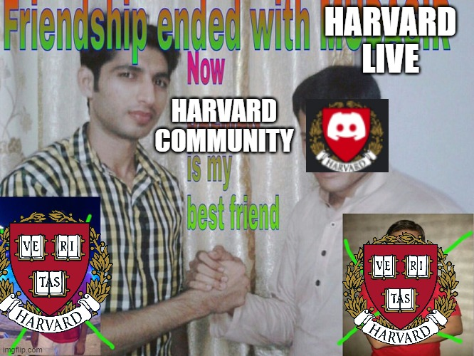

# Migration 
Welcome! This page explains the history of the Harvard Community server, along with our motivation to leave and the commitments we have made to preventing another migration or ownership dispute. 

### Harvard Live 
Many members of this community migrated from another Discord server, Harvard Live.  Harvard Live was, for a long time, unmoderated.  The moderators selected had issues with harassing members and not banning trolls and raiders who would send gore and child porn in the public channels.  When `ManPris`, a co-owner of this server, was added as a moderator on Harvard Live, things began to change for the better.  Student roles and channels were added, and more strict moderation policies were put in place.  About a year or so later, `beetea` became a deputy mod and began adding reaction roles, formal verification processes, and bots to make moderation easier. 

The owner, `Shotdownace`, though, remained inactive.  He would occasionally come online to give direction to the moderation team -- direction that was very uninformed -- or to readjust roles of moderators, which made them unable to perform their jobs.  His response time was upwards of a week, which made adjusting roles or appointing new moderators a struggle.  `ManPris` began talks with `Shotdownace` about ownership in their PMs, which soon evolved into involving `Gdav`, another inactive administrator on the Discord and active moderator on the Reddit.  `Shotdownace` denied `ManPris`'s request for ownership, and soon the issue was brought to the moderation team.  A vote ensued, one in which `Shotdownace` agreed to transfer ownership to `ManPris`. `beetea` was the second place candidate.  The owner then removed `ManPris` as an admin and filed for a transfer through Discord, which is not necessary to transfer ownership.  Because `ManPris` was removed as an administrator, the transfer was not successful, and `Shotdownace` re-awarded `ManPris` his administrator status but refused to follow up with Discord. Thus, for about two weeks, there was complete silence.  Then, the owner came forward and decided he would violate the vote. `Shotdownace` announced to the community that a transfer would occur shortly after student outrage followed this sequence of events.  When, for multiple weeks, this did not happen, `Shotdownace` again went back on his word.  `ManPris` left the server and wrote a heartfelt message to the students, which was deleted by the owner. 

He then disappeared for three months, only reappearing when student dissatisfaction rose to an all-time high, with students leaving.  He held a town hall where he dodged almost every question and refused to admit that his going into the LGBT+ only channel to grab a message (which was not allowed of ANYONE unless they had contacted `beetea` to gain access to the channel) was a violation of privacy.  More students began leaving the server as `Shotdownace` continued to dodge questions and refuse to transfer ownership to `ManPris` or `beetea`.  

In an effort to keep this community rooted and together, we migrated to the Harvard Community server.  `ManPris` and `beetea` had all of the channels, roles, and emojis they created removed, along with the Vanity URL, which was the intellectual property of `ManPris`.  All members were kicked, meaning their autonomy and ability to rejoin the server was not removed of them, and they were invited to the new Harvard Community. 

#### Preventing Ownership Disputes 
This event is certainly not one we want to happen again.  Though the explanation of the situation is above, many students will tell you how disrespected and manipulated they felt throughout the process, something that a few paragraphs of history cannot explain.  Talks went on for multiple months and every conclusion was frivolously disrespected by the owner. 

In order to prevent an issue like this, where power is consolidated in the hands of one person who is unrelated to and uninvolved in the community, this server is owned by two people, `ManPris` and `beetea`.  Both have full access to the email the account is made in.  

The moderation team is dedicated to preventing a Harvard Community exinction event, thus we have decided on conducting bi-yearly student polls. We will poll the students twice a year to gauge satisfaction (or lackthereof) with current leadership. If dissatisfaction cannot be solved by a change in moderation policies and there is overwhelming call for a change of ownership, we will begin selecting a new owner. 

Of course, if dissatisfaction arises within the community earlier, both owners will begin the process of evaluating and fixing the cause of dissatisfaction, including a change in ownership. 

Our plans to prevent this from happening are still in the works. We have daily discussions on how we might prevent an event like this, but the polls are the first step of many. We hope to hear suggestions from the community and will, of course, update you all on how we plan to prevent ownership disputes in the future! 

 
